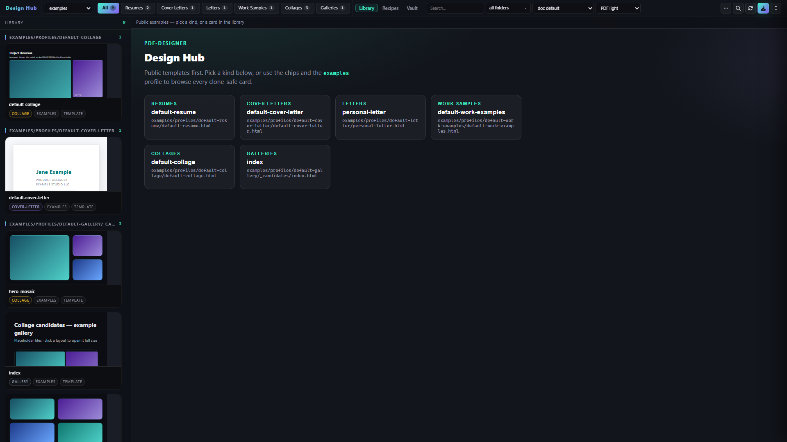
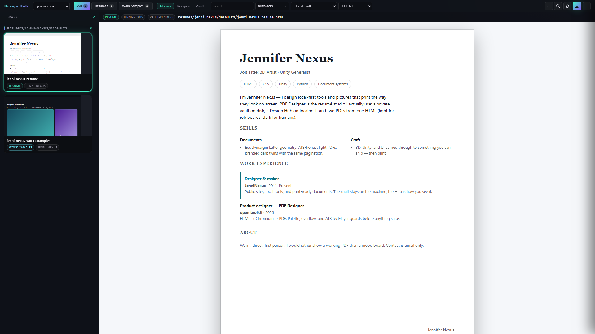
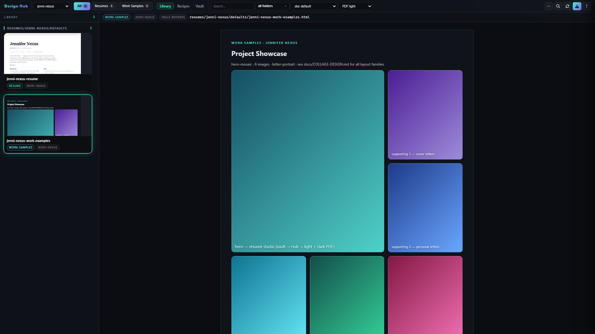
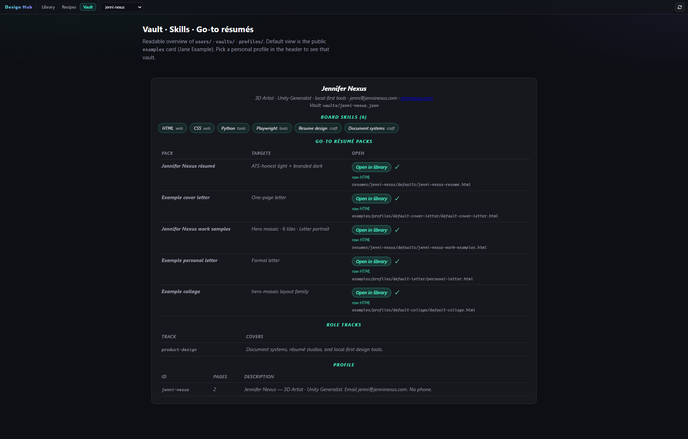
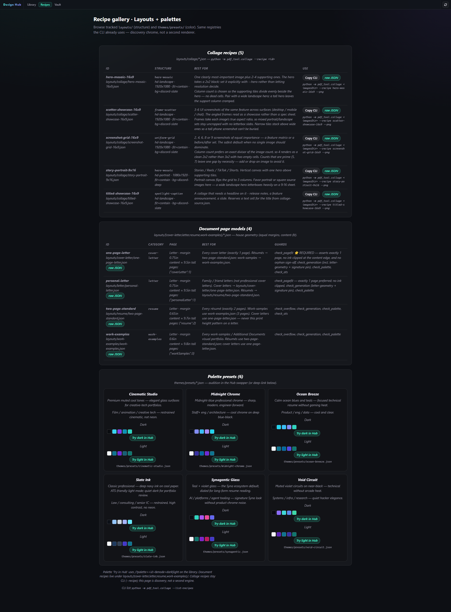

<div align="center">

# 🖨️ PDF Designer

### Design in HTML. Print what you see.
### A local résumé studio that keeps your career data **yours**.


**Zero network calls. Zero environment variables. Zero telemetry.**

</div>



Pick a kind. Swap a palette. Export two PDFs from the same HTML: a **light** file for job boards, and a **dark** branded twin with the **same pages**.

**ATS** means *Applicant Tracking System* — the software employers and boards use to parse résumés. Upload the **light** PDF there. Keep the dark one for humans.

| Create | Verify | Keep control |
|---|---|---|
| Light + dark PDFs from one HTML | Palette, overflow, and ATS text-layer guards | Private vaults stay on disk and gitignored |
| Résumés, letters, work samples, collages | `check_generation` before every ship | No SaaS, no account, no `.env` |

---

## Peek inside the Hub

<table>
<tr>
<td width="50%">

**Jennifer Nexus — light résumé**<br>
Public-brand screenshot pack: real first name, Nexus (not a legal last name), email only.



</td>
<td width="50%">

**Work samples mosaic**<br>
Hero-mosaic, Letter portrait, six tiles — the same family as collage recipes.



</td>
</tr>
<tr>
<td width="50%">

**Vault card**<br>
Skills and go-to packs. Clone default is Jane Example; this still is the public-brand pack.



</td>
<td width="50%">

**Recipes**<br>
Named collage layouts + audition palettes. Try a preset without touching geometry.



</td>
</tr>
</table>

More stills (collage + Jane Example clone template): [`docs/images/review.html`](docs/images/review.html) — open that file in a browser on your machine.

---

## Five minutes on the public path

Works from **tracked files only** — `examples/` + `themes/`. No private folders required.

```bash
git clone https://github.com/jenninexus/pdf-designer.git
cd pdf-designer
pip install -e ".[dev]"
playwright install chromium

# QA + light/dark PDFs + ATS text-layer check
python scripts/smoke-white-label.py

# Design Hub
python -m pdf_tool.preview         # → http://127.0.0.1:8787/
```

```bash
python -m pdf_tool.html_to_pdf examples/profiles/default-resume/default-resume.html
python -m pdf_tool.html_to_pdf examples/profiles/default-resume/default-resume.html --pdf-theme dark
```

Exports land in `_exports/` as `<stem>-light.pdf` / `<stem>-dark.pdf` and **never overwrite** (`-v2`, `-v3`).

Full commands → [`docs/EXPORTS.md`](docs/EXPORTS.md) · ship gate → [`docs/QA.md`](docs/QA.md).

---

## The loop

1. **Start with Jane Example.** Browse [`examples/resume-studio/`](examples/resume-studio/), or copy the profile + theme that fit your work.
2. **Design once.** Light board-upload PDF + dark human-facing PDF, same pagination.
3. **Verify.** `python -m pdf_tool.check_generation <doc>.html` — then `check_ats` on the light PDF before a board upload.

The optional vault workflow keeps claims source-backed. It never auto-submits, and it asks before treating a missing claim as a skill gap.

---

## Docs

| Start here | |
|---|---|
| [`docs/README.md`](docs/README.md) | Docs index |
| [`docs/PRODUCT.md`](docs/PRODUCT.md) | Free GitHub core vs future paid app |
| [`docs/PUBLIC-LOCAL-SPLIT.md`](docs/PUBLIC-LOCAL-SPLIT.md) | What clones see vs what stays local |
| [`docs/GETTING-STARTED.md`](docs/GETTING-STARTED.md) | Clone path without vaults |
| [`docs/PACKAGING.md`](docs/PACKAGING.md) | Wheel must ship themes + layouts |
| [`AGENTS.md`](AGENTS.md) | Agent map + contracts |

Visual tour: [`docs/pdf-designer-overview.html`](docs/pdf-designer-overview.html) · [`printable PDF`](docs/pdf-designer-overview.pdf).

> Protocol seeds on GitHub are `*.example.md` only. Personal vaults, résumés, and job folders stay gitignored.

---

## Principles

- **Local-first** — no upload, no telemetry
- **Source-backed** — generated copy never outruns verified claims
- **No auto-submission** — the tool prepares; the human submits
- **Geometry is locked** — palettes change color, never paper size or pagination
- **Equal margins** on all four edges (default `0.65in`) — [`docs/LAYOUT-SYSTEM.md`](docs/LAYOUT-SYSTEM.md)

---

## License

MIT — use, fork, customize. See [`LICENSE`](LICENSE). © 2026 Jenni Nexus.

Honest MIT: every dependency is permissive (playwright, pypdf, Pillow). AGPL history → [`docs/LICENSING-NOTES.md`](docs/LICENSING-NOTES.md).

<div align="center">

Made with care by [Jenni](https://github.com/jenninexus) at [Monofinity Studio](https://github.com/monofinitystudio).

If this saves you a night of fighting a job board, a [Patreon](https://www.patreon.com/c/JenniNexus) or [PayPal](https://paypal.me/jenninexus) tip is the whole ask.

</div>
