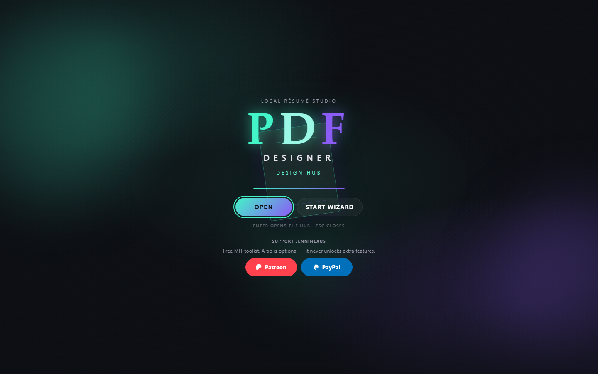

<div align="center">

# PDF Designer

## Design in HTML. Print what you see.
## A local résumé studio that keeps your career data yours.


**Zero network calls. Zero environment variables. Zero telemetry.**

</div>




One HTML file becomes two PDFs: a **light** ATS upload for job boards, and a **dark** branded twin with the **same pages**. Palettes change color, never paper size.

- Light + dark export from the same document
- Palette, overflow, and ATS text-layer guards
- Private vaults stay on disk and gitignored
- No SaaS, no account, no `.env`

---

## Quick start

```bash
git clone https://github.com/jenninexus/pdf-designer.git
cd pdf-designer
pip install -e ".[dev]"
playwright install chromium
python scripts/smoke-white-label.py
python -m pdf_tool.preview          # → http://127.0.0.1:8787/
```

Clone setup, Design Hub wizard, Windows wrapper, and export recipes live in **[`docs/GETTING-STARTED.md`](docs/GETTING-STARTED.md)** — not here.

See the **[public app vs personal workspace diagram](docs/WORKSPACE-LAYOUT.md#two-journeys-one-engine)**
for exactly where new-user `.example` setup, Jenni/Shade vaults, job sources, collages, `output/`,
and private `_exports/` deliverables live.

---

## Peek

<table>
<tr>
<td width="50%">

**Light résumé**<br>
Public-brand pack: first name, Nexus, email only.


</td>
<td width="50%">

**Recipes**<br>
Named layouts + audition palettes. Geometry stays locked.


</td>
</tr>
</table>

More stills: [`docs/images/`](docs/images/README.md).

---

## Docs

| | |
|---|---|
| [`docs/GETTING-STARTED.md`](docs/GETTING-STARTED.md) | Clone path, Hub, smoke, commands |
| [`docs/README.md`](docs/README.md) | Full index |
| [`docs/PRODUCT.md`](docs/PRODUCT.md) | Free GitHub vs later paid shell |
| [`AGENTS.md`](AGENTS.md) | Agent map (contributors) |

Protocol seeds on GitHub are `*.example.md` only. Personal vaults stay gitignored.

---

MIT — use, fork, customize. See [`LICENSE`](LICENSE). © 2026 Jenni Nexus.

Honest MIT: playwright, pypdf, pypdfium2, Pillow. AGPL history → [`docs/LICENSING-NOTES.md`](docs/LICENSING-NOTES.md).

<div align="center">

If this saves you a night of fighting a job board, a **$3 or $5** tip is welcome — it never unlocks extra features.

[Star this repo](https://github.com/jenninexus/pdf-designer) · [Links](https://jenninexus.com/links) · [Patreon](https://www.patreon.com/c/JenniNexus) · [PayPal](https://paypal.me/jenninexus)

Published by [Jenni](https://github.com/jenninexus) at [Monofinity Studio](https://github.com/monofinitystudio).

</div>
