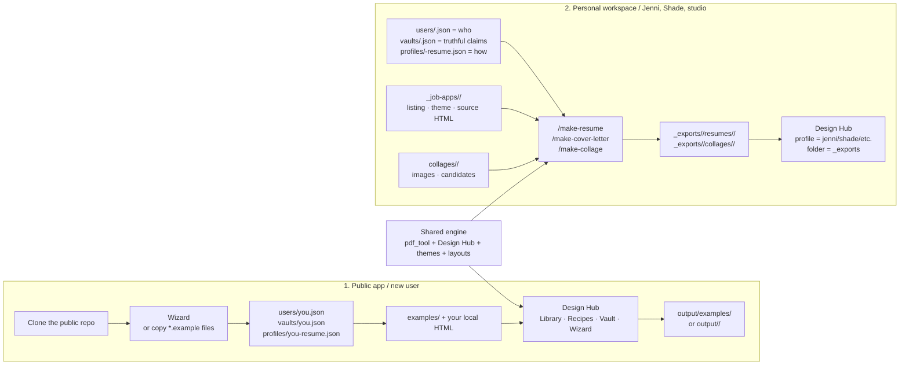

# Workspace layout — product UX for local files

**Status:** path resolver + root README scaffolds + SEGO **data copy** (2026-08-13).
**`storage/` is retired (2026-08-17).** Private application material remains local and the
private font moved to `brands/fonts/`. The engine still accepts `storage/`
aliases. Copy script (historical): `python scripts/migrate-workspace.py`.

This page is the **clone-safe product story**: what a future GitHub user should see at the
repo root, vs what stays private on their machine.

---

## Two journeys, one engine



The split is about **content and defaults**, not two applications. Public/example exports use
`output/`; personal commands explicitly send final deliverables to `_exports/`. Both are ignored
payload trees with tracked README anchors. In the Hub, select a personal profile to see its source
documents, choose **`_exports`** in the folder picker to see finished PDFs/images, and open **Vault**
to inspect that profile's claims.

### Find or edit something quickly

| I want to… | Go here |
|---|---|
| Set up as a new user | Run `/wizard`, or copy `users/you.example.json`, `vaults/you.example.json`, and `profiles/you-resume.example.json` to non-`.example` local files |
| Customize the public command workflow | Copy `.claude/commands/make-*.example.md` to the matching bare `.md`; edit the bare copy locally |
| Edit Jenni/Shade identity or contact | `users/<user>.json` |
| Edit truthful résumé facts or application voice | `vaults/<user>.json` |
| Edit layout/export behavior | `profiles/<user>-resume.json` |
| Edit reusable résumé HTML | `resumes/<user>/` |
| Edit one job application | `_job-apps/<application>/` |
| Edit collage sources/candidates | `collages/<project>/` |
| Find finished personal PDFs/images | `_exports/<user>/<kind>/...`, or Hub → profile → folder `_exports` |
| Find public/example smoke output | `output/` |
| Add reusable colors or structure | `themes/` or `layouts/` (tracked; never personal content) |

This is the authoritative two-journey map. [`GETTING-STARTED.md`](GETTING-STARTED.md) owns installation,
[`PREVIEWER.md`](PREVIEWER.md) owns Hub controls, and [`STORAGE.md`](STORAGE.md) owns path-resolution details.

---

## Verdict (short)

**Yes — move personal workspace to the repo root.** A single opaque `storage/` bag feels like
dev plumbing, not a résumé product. Root nouns (`users/`, `vaults/`, `profiles/`, `resumes/`,
`collages/`, `_job-apps/`, `brands/`, `_exports/`) match how people think and how we want the free
GitHub product to teach itself.

**Do not** dump live Jenni/Shade data into tracked folders. Root dirs ship as **empty scaffolds
+ README + examples**; real JSON/HTML/PDFs stay gitignored — same privacy bar as today.

The migration is complete. `preview.py`, `check_vault`, and `tracker` resolve legacy `storage/` URLs
only when the corresponding root-noun payload exists; new content must use root nouns.

---

## Target tree (after migration)

```
pdf-designer/
  # ── Engine (public, tracked) ─────────────────────────────
  src/pdf_tool/   themes/   layouts/   examples/   docs/   AGENTS.md

  # ── Local workspace (intuitive nouns — real files gitignored) ──
  users/            # WHO  — users/<id>.json (+ users/README.md tracked)
  vaults/           # WHAT — vaults/<id>.json  (was <user>/resume-source.json)
  profiles/         # HOW  — profiles/<id>-resume.json
  resumes/          # WORK — resumes/<id>/{html,defaults,resources}
  output/           # ENGINE OUT — clone-safe default + public examples
  _exports/         # PERSONAL OUT — _exports/<id>/{resumes,collages}/
  _job-apps/        # JOB  — _job-apps/<Track>/  (canonical; applications/ is README-only)
  collages/         # collage projects
  brands/           # private brand maps (was storage/brand-design/)

  # ── Teaching surface (public, tracked) ───────────────────
  examples/
    resume-studio/          # product front door
    users/                  # sample person card
    vaults/                 # sample vault (fake claims)
    profiles/               # already exists
    applications/           # still examples/_job-listings/ until a later examples rename
    brand-design/           # already exists
    collages/               # tiny sample image set (optional)
```

### Why these nouns

| Noun | Answers | Replaces |
|---|---|---|
| `users/` | Who am I? contact, voice prefs | `storage/users/` |
| `vaults/` | What may I claim? | `storage/<user>/resume-source.json` |
| `profiles/` | How does it print? | `storage/profiles/` |
| `resumes/` | Working HTML + defaults | `storage/jenni/` · `shade/` · `studio/` |
| `output/` | Public engine/example output | ad-hoc generated files beside source HTML |
| `_exports/` | Private personal/applicant deliverables | `storage/<user>/_exports/` · personal payload previously mixed into `output/` |
| `_job-apps/` | This job | **canonical.** `applications/` is a tracked README redirect only (no listings). `storage/_job-listings/` is a retired alias — do not store listings there. |
| `collages/` | Image layouts | `storage/collages/` |
| `brands/` | My palette map | `storage/brand-design/` |

`vaults/` as a top-level word is load-bearing for marketing — the product *is* vault-backed
résumés. Hiding the vault under a person folder made the pitch harder to see on GitHub.

### Studio / shared assets

Shared MG gallery stays under **`resumes/studio/resources/…`** (or `brands/martian/resources/`)
with junctions from `resumes/jenni/` and `resumes/shade/` — same rule as today, clearer path.

---

## Gitignore pattern (product-shaped)

Track **READMEs + `*.example.*`**; ignore real data:

```gitignore
# Local workspace — keep directories discoverable, hide personal files
users/*
!users/README.md
!users/*.example.json
!users/examples.json

vaults/*
!vaults/README.md
!vaults/*.example.json
!vaults/examples.json

profiles/*
!profiles/README.md
!profiles/*.example.json
!profiles/examples.json

resumes/*
!resumes/README.md

_job-apps/*
!_job-apps/README.md
!_job-apps/_template/

# Optional alias — README redirect only; do not store listings here
applications/*
!applications/README.md

collages/*
!collages/README.md

brands/*
!brands/README.md
!brands/*.example.json

output/*
!output/README.md

# Private personal deliverables; keep only the public guide
**/_exports/
!/_exports/
/_exports/*
!/_exports/README.md

# Local legacy residue; retain for recovery/history, never add new live work
storage/
```

Strangers cloning the free repo see the folder names in GitHub’s file tree (via README
files) and copy from `examples/` — they never pull your vault.

---

## Docs stay under `docs/` only

| Tracked (public) | Local-only (same `docs/` folder, gitignored) |
|---|---|
| `PRODUCT.md` · `WORKSPACE-LAYOUT.md` · `GETTING-STARTED.md` · `STORAGE.md` (legacy until cutover) · `PUBLIC-LOCAL-SPLIT.md` · … | `MARKETING.md` · `WORKSPACE.md` · `HISTORY-SCRUB.md` · `*.local.md` |

No second docs tree under `storage/docs/`. Private notes live beside public docs; gitignore
hides them from clones.

---

## Migration phases (see active plan)

1. **Docs + ignore** — private notes → `docs/`; stop using `storage/docs/` ✅
2. **Path resolver** — `pdf_tool.paths` accepts both trees (Hub + CLI) ✅
3. **Scaffold root dirs** — README stubs on GitHub ✅
4. **Move SEGO data** — copy `storage/*` → new nouns; keep `storage/` as read-only alias  ✅ `scripts/migrate-workspace.py`
5. **Delete `storage/`** — ✅ retired 2026-08-17 after smoke + Hub + tracker verification; retain the resolver only for old URLs.

---

## Inspiration for free → tip / pay

| Moment | Free GitHub | Paid later |
|---|---|---|
| Clone | Sees `users/` · `vaults/` · `examples/resume-studio/` | Installer creates the same folders |
| First win | Copy example vault → edit → light+dark PDF | Wizard: create vault → pick skills → export |
| Trust | `.gitignore` proves we never want their PII | Same local folders; optional sync of themes only |

---

## Related

- Live layout today: [`STORAGE.md`](STORAGE.md)
- Architecture: [`PUBLIC-LOCAL-SPLIT.md`](PUBLIC-LOCAL-SPLIT.md)
- Product thesis: [`PRODUCT.md`](PRODUCT.md)
- Product backlog: [`ROADMAP.md`](ROADMAP.md) · optional execution slice: [`../Plans/_Active/`](../Plans/_Active/)
